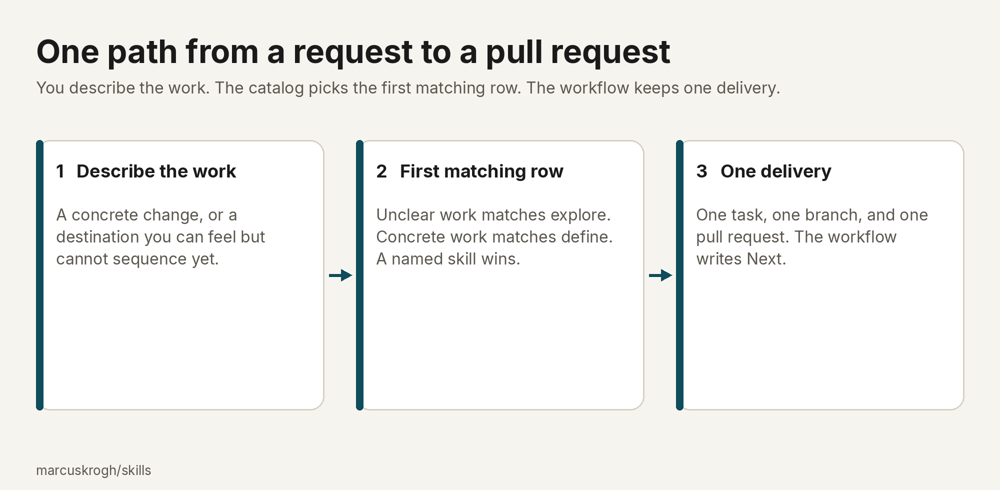
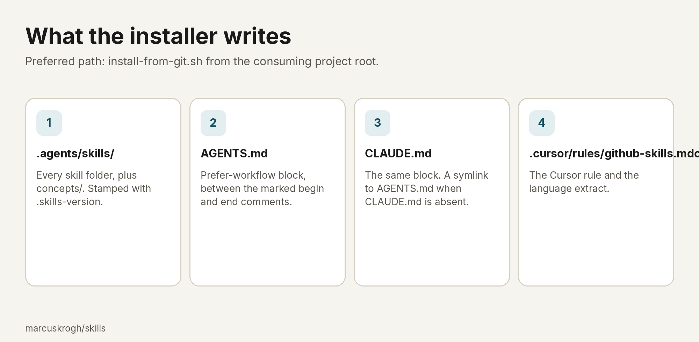
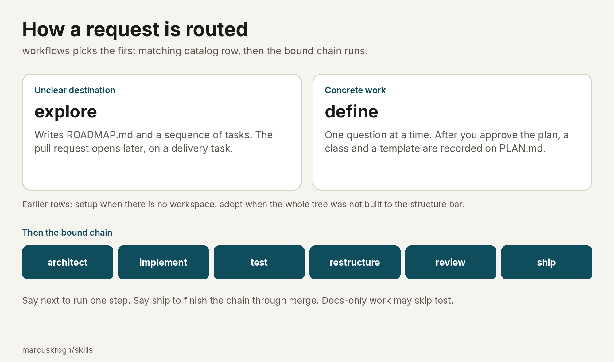

# Agent Skills

[](https://skills.sh/marcuskrogh/skills)

Reusable skills for taking a request through definition, architecture, implementation, tests, structure, review, and merge. The motivation is a path that stays the same. You describe the work. The agent picks the first matching catalog row. Concrete work is interviewed, and after you approve the plan the agent records a class and a template, then follows that chain. A skill produces one output. The workflow writes Next.

Install copies the skill files into a project, or into this repository when you author them, so the next chat in that harness follows the catalog. Built on the [Agent Skills](https://agentskills.io) standard. Works with Cursor, Claude Code, Codex, GitHub Copilot, and other compatible editors.



## Install

Ask an agent in the consuming repository. That is the preferred path. Agents follow [`agent-install.md`](skills/manage-skills/agent-install.md).

Paste this prompt:

```text
Install marcuskrogh/skills into this repository from git using the canonical
installer. Do not use another install method.

1. From the project root, run exactly:
   curl -fsSL https://raw.githubusercontent.com/marcuskrogh/skills/main/scripts/install-from-git.sh | bash
2. If curl|bash is unavailable: shallow-clone
   https://github.com/marcuskrogh/skills.git at ref main into a temp dir, then
   run: bash <clone>/scripts/install-from-git.sh
3. Commit the paths the script lists (.agents/skills/, AGENTS.md, CLAUDE.md,
   .cursor/rules/github-skills.mdc).
4. Confirm .agents/skills/.skills-version exists and
   .agents/skills/workflows/SKILL.md is present.
```

Or run this from the consuming project root:

```bash
curl -fsSL https://raw.githubusercontent.com/marcuskrogh/skills/main/scripts/install-from-git.sh | bash
```

If `curl | bash` is unavailable:

```bash
git clone --depth 1 https://github.com/marcuskrogh/skills.git /tmp/marcuskrogh-skills
bash /tmp/marcuskrogh-skills/scripts/install-from-git.sh
```

The script replaces `.agents/skills/` (every skill folder plus `concepts/`), stamps `.agents/skills/.skills-version`, and wires the prefer-workflow pointers.



Commit those four paths. Confirm:

```bash
test -f .agents/skills/.skills-version
test -f .agents/skills/workflows/SKILL.md
test -d .agents/skills/concepts
grep -q 'marcuskrogh/skills:begin' AGENTS.md
```

Pinning, skills.sh, the Claude Code plugin, updates, author setup, and project sync are in [Install](docs/guide/install.md).

## What it does

After install, describe the work, or name a skill (`/define`, `/help`). An unnamed delivery request is recognised by [`workflows`](skills/workflows/SKILL.md). The first matching catalog row is the path. An explicit `/skill` name wins over re-routing.



If there is no usable `WORKSPACE.md`, the first row is [`setup`](skills/setup/SKILL.md). A whole tree that was not built to the structure bar matches [`adopt`](skills/adopt/SKILL.md) before define.

Concrete work (a bug, a tweak, a refine, a rework, or a feature) goes through [`define`](skills/define/SKILL.md). Define asks one question at a time until scope, behaviour, constraints, and pass criteria are settled. You approve the plan. A short description starts that interview. It does not approve the plan. Define then records a class and a template on `PLAN.md`, and opens one task, one branch, and one draft pull request.

An unclear destination goes through [`explore`](skills/explore/SKILL.md). Explore writes `ROADMAP.md` and a sequence of tasks. The delivery pull request opens later, on a delivery task.

You continue with the persisted Next line, or you say `next` or `ship`. `next` runs one step. `ship` runs the rest of the chain through merge.

A reply that finishes a skill ends with:

```markdown
## Next
`/<skill> <ISSUE-KEY>` — <one-line why>
```

An open interview question has no Next block and does not start the next skill.

[`/help`](skills/help/SKILL.md) maps the choices and stops. [`/guide`](skills/guide/SKILL.md) walks a manual task one step at a time. [`/explain`](skills/explain/SKILL.md) teaches the current step. Guide and explain can interrupt without replacing the bound chain.

### Examples

Concrete work. You say "Add X", "this test fails", or "rewrite the README", and you do not name `/bug` or `/refine`. The router matches define. You should see one question at a time, then the readiness prompt "Does this plan and workflow binding look right?" After you approve: `PLAN.md`, a task, a branch, and a draft pull request. Next is usually `/architect`.

Unclear destination. You can feel the end state and not the steps. The router matches explore. You should see `ROADMAP.md` and sequenced route tasks. Next is the frontier, often `/define` on a route task.

Map only. You ask which skill to use, or you say `/help`. Help shows the front doors and stops. It does not start setup, explore, or define unless you then ask to begin that work.

Adopt, research, sandbox, a merged pull request, `next`, and `ship` are in [Examples](docs/guide/examples.md).

## Chapters

These pages hold the rest of the description.

| Chapter | What it covers |
|---------|----------------|
| [Install](docs/guide/install.md) | Pinning, updates, skills.sh, the Claude Code plugin, author setup, project sync, first use |
| [Structure](docs/guide/structure.md) | Tree, directories, scripts, templates, and what is not a skill |
| [How it works](docs/guide/how-it-works.md) | Skills and concepts, routing, classification, Next, tracker, language |
| [Workflows](docs/guide/workflows.md) | Which workflow runs in which situation, templates, and chains |
| [Skills](docs/guide/skills.md) | Each skill: how to use it, where, outputs, and which workflows invoke it |
| [Concepts](docs/guide/concepts.md) | Shared invariants and disclosed catalogs |
| [Examples](docs/guide/examples.md) | Applied situations taken from the catalog |

The local map of those pages is [docs/guide/README.md](docs/guide/README.md). A short map in chat is [`/help`](skills/help/SKILL.md).
